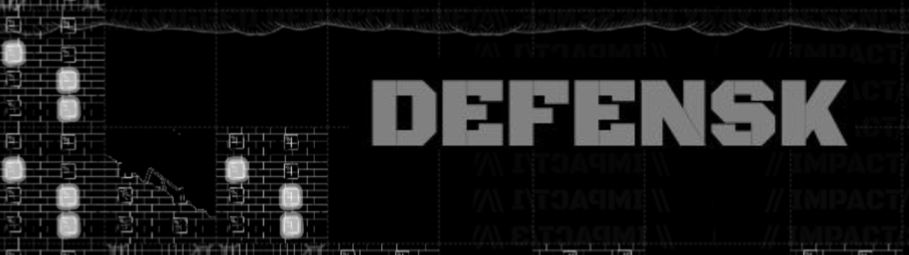

Build and defend your city in this click to shoot air defense game. Build
residential buildings and increase balance, build command building for
city administration, build research lab to upgrade your defense, build
trade center to control trades, etc.

# Progress
## 0.0.7
- Buildings unimplemented, but can be constructed
- Factory produces missile by default, but can't be configured
- Fix and Rebuild is functional

### todo
- Add options for factory production
- Prototype for Command Map and Diplomacy
- Variable Build Time
- Additional texture as build is being constructed
- Need to do something with auto defense missile
- Add planes, with varying consequence in these cases
- - Plane passes by
- - Plane shot down
- - Plane flying

# Plan
## Actually implement research lab, trade center, and transit
## Global map
visit another city, send troop and conquer other city. Your interaction
with enemy city will affect attack frequency
## Miscellaneous buildings
Decoration among other stuff
